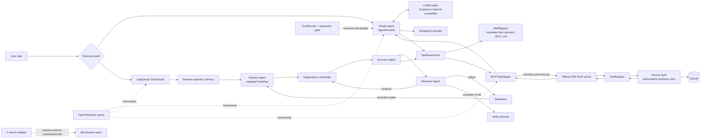

# Enterprise Agent Reliability Lab

[](https://github.com/qwsvd/enterprise-agent-reliability-lab/actions)

**[Live Demo](https://enterprise-agent-reliability-lab.onrender.com/)** ·
**[API Docs](https://enterprise-agent-reliability-lab.onrender.com/docs)** ·
**[Health](https://enterprise-agent-reliability-lab.onrender.com/health)** ·
**[GitHub Actions](https://github.com/qwsvd/enterprise-agent-reliability-lab/actions)** ·
**Source version 1.1.0** ·
**[Published Release v1.0.1](https://github.com/qwsvd/enterprise-agent-reliability-lab/releases/tag/v1.0.1)**

A production-oriented reference implementation of an enterprise after-sales AI Agent:
typed business APIs, LLM tool calling, MCP discovery, progressively loaded Agent
Skills, official-LangGraph multi-agent orchestration, working and episodic memory,
reflection and bounded replanning, reliability controls, OpenTelemetry traces,
deterministic regression evals, an external τ³-bench adapter, and Docker/CI delivery.

> **Scenario:** Customer `CUS-001` reports that order `ORD-1024`—a `299.00 CNY`
> shipment delayed by 10 days—has not arrived. The Agent inspects customer, order,
> shipment, and policy state; creates an eligible idempotent refund and support
> ticket; and reports the exact completed or pending-approval outcome.

Run the most representative proof locally—no API key, network, paid model, external
MCP server, telemetry collector, or benchmark installation required:

```bash
python -m pip install -e ".[dev]"
after-sales-demo
after-sales-multi-agent-demo
python -m pytest
```

```text
User task -> Single-Agent AgentRuntime OR LangGraph multi-agent orchestration
          -> reliability controls -> selected SKILL.md -> MCP-discovered tools
          -> service layer -> SQLite -> trace -> deterministic eval gate
```

## Why this project exists

Tool calling alone is not an enterprise Agent. A useful system must preserve business
rules, constrain retries and side effects, explain what happened, and detect behavior
regressions. This repository demonstrates those boundaries with small typed modules:

- **FastAPI + SQLAlchemy** provide real, persistent customer-service state and keep
  refund policy authoritative outside the model.
- **AgentRuntime + provider abstraction** implement a bounded multi-step tool loop
  that works with a deterministic provider or an optional OpenAI-compatible endpoint.
- **LangGraph orchestration** adds separate Planner, dependency Scheduler, Executor,
  and Reviewer roles with typed state, reflection, and bounded replanning while
  preserving the Single-Agent implementation for comparison.
- **Working and episodic memory** retain current-run evidence and persist sanitized
  episode summaries in SQLite for bounded, deterministic retrieval before planning.
- **Agent Skills** supply versioned workflow guidance through progressive disclosure;
  they do not mutate state or replace policy.
- **MCP** supplies protocol-level capability discovery and invocation without
  hard-coding tool schemas in the client.
- **Reliability controls** enforce budgets, typed timeouts, bounded retries, repeated
  call detection, failure limits, and conservative side-effect replay rules.
- **OpenTelemetry** reconstructs Agent, provider, Skill, MCP, tool, retry, and
  termination behavior while excluding prompts, credentials, PII, and tool payloads.
- **Deterministic evals** grade observable behavior, persistence, safety, counters,
  tool sequences, traces, and unsupported claims behind a regression gate.
- **τ³-bench integration** creates an honest external benchmark boundary without
  vendoring data, fabricating scores, or breaking this project's Python range.
- **Docker + CI** package the API as a non-root image and continuously validate the
  supported Python range, package, tests, and container.

## Architecture

The diagram reflects the implemented code paths; arrows are execution or delegation,
while dashed lines are cross-cutting verification boundaries.



Key boundaries:

- **Skill** = reusable workflow instructions.
- **Tool** = executable capability.
- **MCP** = protocol and dynamic capability-discovery boundary.
- **Service layer** = authoritative business policy and mutations.
- **Reliability** = runtime guard and recovery policy.
- **Tracing** = payload-safe execution evidence.
- **Eval** = deterministic behavioral verification.
- **Benchmark adapter** = interoperability with an external evaluation ecosystem.

### Repository map

| Path | Responsibility |
|---|---|
| `app/api.py`, `app/services.py`, `app/models.py` | HTTP API, business policy, persistence |
| `app/agent/` | provider-neutral Agent loop, providers, tools, typed results |
| `app/orchestration/` | LangGraph multi-agent planning, scheduling, execution, review, memory, demos, evals |
| `app/mcp_integration/` | official-SDK MCP server, client, discovery adapter |
| `.agents/skills/`, `app/skills/` | `SKILL.md` workflows and progressive loader |
| `app/reliability/` | budgets, retries, timeouts, loop and side-effect guards |
| `app/tracing/` | OpenTelemetry instrumentation and in-memory exporter |
| `evals/cases.yaml`, `app/evals/` | versioned cases, grading, metrics, regression gate |
| `evals/orchestration_cases.yaml` | versioned multi-agent success, approval, recovery, and budget cases |
| `app/benchmarks/` | provider-neutral benchmark contracts and τ³ adapter |
| `app/demo.py` | deterministic integrated reviewer demo |
| `Dockerfile`, `.github/workflows/ci.yml` | production API image and CI validation |

## Engineering capability matrix

| Phase | Implemented capability | What it demonstrates |
|---:|---|---|
| 1 | FastAPI business backend, SQLAlchemy/SQLite, seeded domain state | Typed APIs, persistence, service-layer policy, idempotency |
| 2 | Bounded LLM tool-calling Agent with real and scripted providers | Provider abstraction, multi-step state, validated tools, offline tests |
| 3 | Official MCP SDK server/client and dynamic tool discovery | Protocol integration without duplicating schemas or business rules |
| 4 | Repository `SKILL.md` workflows and on-demand loading | Progressive disclosure and separation of guidance from capabilities |
| 5 | Budgets, retries, timeouts, loop/failure and side-effect guards | Safe failure, deterministic recovery, explicit terminal reasons |
| 6 | Vendor-neutral OpenTelemetry span hierarchy | Reconstructable execution without leaking sensitive payloads |
| 7 | Versioned deterministic Agent eval suite and regression gate | Outcome, tool, state, safety, reliability, trace, and claim grading |
| 8 | Provider-neutral external benchmark layer and τ³-bench adapter | Honest task/result interoperability across runtime constraints |
| 9 | Multi-stage non-root Docker image and GitHub Actions CI | Repeatable packaging and continuous Python/test/container validation |
| 10 | Reviewer-oriented documentation and integrated deterministic demo | Verifiable portfolio surface without fabricated results |
| 11 | Official LangGraph multi-agent runtime, memory, reflection, replanning, and eval comparison | Planning, dependency scheduling, specialized roles, recovery, persistent context, and measurable architecture trade-offs |

## Single-Agent and Multi-Agent architectures

The two runtimes are intentionally retained side by side:

- **Single-Agent:** `app/agent/runtime.py` owns one bounded provider/tool loop. It is
  the compact reference path and the baseline used by existing evals.
- **Multi-Agent:** `app/orchestration/graph.py` compiles a real LangGraph
  `StateGraph`. Named nodes retrieve memory, plan, schedule dependency-ready work,
  execute one task, review evidence, reflect, replan when bounded policy permits,
  and persist the final episode.

Concrete responsibilities remain narrow:

- **Planning:** `ProviderPlanner` reuses `LLMProvider` and validates JSON against
  `TaskPlan`; `ScriptedPlanner` and `DeterministicPlanner` provide offline paths.
- **Scheduling:** `DependencyScheduler` validates references, detects cycles, marks
  dependency-blocked work, and selects ready tasks by priority and graph state.
- **Tool use:** `ExecutorAgent` resolves values from prior evidence and invokes the
  existing `SkillAwareTools`/`MCPToolAdapter` boundary. It never calls SQLAlchemy
  business models directly.
- **Reflection:** `EvidenceReviewer` rejects missing evidence and unsupported
  completion claims. Structured reflections feed a bounded planner re-entry.
- **Memory:** `WorkingMemory` holds the active plan, evidence, executions, reviews,
  and reflections. `EpisodicMemoryStore` persists sanitized episode summaries and
  retrieves relevant history with explicit lexical overlap—not embeddings.

### Multi-Agent reliability and observability

`OrchestrationConfig` adds maximum graph steps, replans, reflections, task attempts,
repeated tasks, and repeated effective plans while reusing the existing model/tool
budgets, timeout values, side-effect classifications, and idempotency policy.
Non-idempotent ticket calls are never replayed after an ambiguous outcome. Every
terminal path has a typed `OrchestrationTermination` value.

The root `multi_agent.run` span contains payload-safe children:
`memory.retrieve`, `planner.plan`, `scheduler.select`, `executor.task`,
`reviewer.review`, optional `reflection` and `planner.replan`, and `memory.write`.
MCP, Skill, and retry spans remain nested through existing tracer injection. Traces
contain roles, counts, statuses, attempts, and termination categories—not goals,
business identifiers, prompts, arguments, results, PII, or credentials.

## Deterministic end-to-end demo

`after-sales-demo` runs three curated cases through the real Phase 7 evaluation path:

1. delayed-order resolution through `AgentRuntime`, selected Skill, MCP tools, service
   policy, refund/ticket persistence, tracing, and evaluation;
2. a transient provider failure that recovers through one observable bounded retry;
3. a high-value refund that remains `pending_human_approval` and is never represented
   as completed.

It prints executed tool sequences, loaded Skills, resulting business state,
reliability counters, trace span counts, per-scenario checks, and the regression-gate
outcome. Every value is computed from the run—no canned benchmark result is shown.

```bash
after-sales-demo
after-sales-demo --format json
```

The demo uses `ScriptedProvider`, temporary SQLite databases, in-process official-SDK
MCP, injected retry sleeping, and an in-memory OpenTelemetry exporter. Temporary state
is removed when each scenario finishes.

### LangGraph multi-agent demo and comparison

```bash
after-sales-multi-agent-demo
after-sales-multi-agent-demo --format json
```

The command performs a real offline warm-up episode and then a second run whose
Planner receives the retrieved episode. The printed plan, dependency-driven execution
order, MCP tool sequence, reviews, reflections, persisted business outcome,
termination reason, counters, measured wall-clock latency, and trace spans all come
from execution. It also runs the existing Single-Agent eval case and prints a
side-by-side comparison of success, steps, tool/model calls, replans, reflections,
retries, and reliability outcome. The deterministic planner has no token-usage
metadata, so token counts and monetary cost remain explicitly unavailable.

## Setup

Python 3.11 or newer is required.

```bash
python -m venv .venv
```

Activate the environment:

```bash
# macOS/Linux
source .venv/bin/activate

# Windows PowerShell
.venv\Scripts\Activate.ps1
```

Install the package and test dependencies from the repository root:

```bash
python -m pip install -e ".[dev]"
```

## Copy-paste command guide

All commands below map to checked-in console scripts or modules.

### API/backend

```bash
python -m uvicorn app.main:app --reload
```

The first startup creates `after_sales.db` and idempotently seeds the demo customer,
order, and delayed shipment. Open `http://127.0.0.1:8000/docs` or verify health:

```bash
curl http://127.0.0.1:8000/health
```

Set `DATABASE_URL` to override `sqlite:///./after_sales.db`; see `.env.example`.
The implemented API surface is `GET /health`, `GET /customers/{customer_code}`,
`GET /orders/{order_code}`, `GET /orders/{order_code}/shipping`,
`GET /policies/refund`, `POST /refunds`, and `POST /tickets`. Refund creation
requires an `Idempotency-Key` header.

### Agent CLI

Use the offline final Agent CLI for a credential-free run:

```bash
after-sales-demo
```

The optional real-provider CLI uses OpenAI-compatible Chat Completions tool calling:

```bash
after-sales-agent "Handle delayed order ORD-1024 and report the outcome."
```

Before the optional command, configure `LLM_BASE_URL`, `LLM_API_KEY`, `LLM_MODEL`,
and optionally `LLM_TIMEOUT_SECONDS` in the shell from `.env.example`. The repository
does not claim a real-model result unless that command is actually run.

### Multi-Agent orchestration

Run the deterministic LangGraph orchestration and its versioned regression suite:

```bash
after-sales-multi-agent-demo
after-sales-multi-agent-demo --format json
after-sales-multi-agent-eval
after-sales-multi-agent-eval --case multi-agent-high-value
after-sales-multi-agent-eval --format json
```

The default path is offline. `ProviderPlanner` is the optional real
OpenAI-compatible planning path: it stays behind the existing `LLMProvider`, sends
available tool schemas and bounded memory/reflection context, and accepts only a
strictly validated `TaskPlan` JSON response.

### MCP

Run the deterministic Agent over a real local stdio MCP transport:

```bash
after-sales-mcp-demo
```

Start the stdio server for another local MCP client or inspector:

```bash
after-sales-mcp-server
```

The automated evals and final demo use the official SDK's in-process transport for
determinism; neither path hand-rolls protocol negotiation.

### Agent Skills

```bash
after-sales-skills-demo
```

The initial Agent context contains only Skill names and descriptions. The selected
complete `SKILL.md` is loaded through `load_skill`; unrelated bodies stay unloaded.

### OpenTelemetry tracing

```bash
after-sales-tracing-demo
python -m pytest tests/test_tracing.py
python -m pytest tests/test_orchestration.py -k trace
```

The demo prints sanitized in-memory span names, parents, attributes, and Agent
counters. It sends nothing to an external collector.

### Reliability controls

```bash
python -m pytest tests/test_reliability.py
python -m pytest tests/test_orchestration.py
```

These tests cover success, model/tool/step budgets, transient recovery, retry
exhaustion, permanent failure, repeated calls, timeout behavior, consecutive failure
limits, idempotent refund replay, and blocked non-idempotent ticket replay. No test
performs real waiting.

### Local deterministic evals

```bash
after-sales-eval
after-sales-eval --case high-value-human-approval
after-sales-eval --format json
```

The versioned suite in `evals/cases.yaml` supports full or selected execution.
Regression-gate failure returns a nonzero exit status.

Multi-Agent eval cases live separately in `evals/orchestration_cases.yaml` so the
Single-Agent baseline remains directly comparable. They grade task completion, plan
validity, dependency correctness, tool selection/execution, final business state,
unsupported claims, human approval, reflection recovery, replans, steps, calls,
termination, and measured latency. Exact latency is reported but is not used as a
fabricated performance target.

### External benchmark adapter

Inspect the supported τ³-bench contract and whether a separately installed upstream
runtime is available:

```bash
after-sales-benchmark inspect
after-sales-benchmark inspect --format json
```

This command does not download τ³-bench or create a score. The maintained upstream
package currently has a narrower Python range, so execution stays in a separate
compatible environment and official result JSON is imported through the adapter.
See the synthetic contract examples under `tests/fixtures/benchmarks/` for validation
tests; they are not official tasks or scores.

### Complete verification

```bash
python -m pytest
python -m pip check
python -m compileall -q app
after-sales-multi-agent-eval
```

Tests are isolated and offline: no LLM key, paid request, network, MCP server,
collector, downloaded benchmark, or real sleep is required.

### Docker

Build and run the production API image:

```bash
docker build --pull -t enterprise-agent-reliability-lab .
docker run --rm -p 8000:8000 -v after-sales-data:/data enterprise-agent-reliability-lab
```

The multi-stage Python 3.11 slim image runs as numeric user/group `10001:10001`,
stores SQLite state at `/data/after_sales.db`, honors `PORT` when supplied (default
`8000`), and health-checks `GET /health` on the same resolved port.
`.dockerignore` allowlists the build context so local credentials, databases, Git
metadata, tests, and generated files are excluded.

## Business behavior under test

The service layer—not prompts, Skills, MCP handlers, or eval code—enforces:

- shipment delay of at least 7 days may qualify for refund;
- refund amount cannot exceed order amount;
- an order cannot be refunded twice;
- identical idempotency-key retries return the original refund;
- reusing a key for a different request is rejected;
- refunds above `1000 CNY` are stored as `pending_human_approval`;
- pending approval is not exposed as a completed refund;
- support-ticket creation is non-idempotent and is not automatically replayed after
  an ambiguous side-effect result.

## CI and delivery

`.github/workflows/ci.yml` runs on pull requests targeting `main` and pushes to
`main`. It tests Python 3.11–3.14, installs `.[dev]`, runs `pip check`, the complete
pytest suite, imports, and a wheel build, then builds and inspects the production
image. Workflow permissions are read-only, checkout credentials are not persisted,
and third-party actions are pinned to immutable commit SHAs.

The container is intentionally the FastAPI application runtime. Local eval datasets,
repository Skills, test fixtures, and the external benchmark environment are not
copied into the production API image.

## Security, privacy, and evaluation integrity

- No credentials are committed; optional provider secrets are runtime environment
  variables only.
- Traces contain bounded operational metadata, never full prompts, tool arguments or
  results, customer PII, order identifiers, idempotency keys, endpoints, credentials,
  or exception messages.
- External benchmark execution is distinct from local eval execution and imported
  benchmark results. The project never treats process success as a benchmark score.
- No real LLM, interoperability, benchmark, performance, or production metric is
  claimed unless it was actually executed.
- Episodic memory applies one pre-persistence redaction boundary to goals and task
  objectives, derives retrieval terms only from the redacted goal, and keeps the
  existing evidence whitelist. Email addresses, phone numbers, customer/order/
  tracking identifiers, credential-like identifiers, and Skill bodies are excluded
  from persisted and retrieved episodes.
- Planner model calls are optional. Offline demos report model calls as zero and do
  not infer token usage or cost when the provider does not supply usage metadata.

## Scope and attribution

This is a focused Agent engineering laboratory with both a Single-Agent baseline and
a LangGraph multi-agent orchestration path. RAG, vector memory, frontend,
Kubernetes, OAuth, and unrelated infrastructure remain deliberately out of scope.

Phase 8 targets Sierra Research's maintained
[τ³-bench / `tau2` repository](https://github.com/sierra-research/tau2-bench) through
a data-contract and external-process boundary. No upstream source or dataset is
vendored. See `THIRD_PARTY_NOTICES.md` for license attribution and fixture provenance.
The repository's own license is in `LICENSE`.

LangGraph is consumed as an official PyPI dependency under its MIT License; no
upstream source is vendored. See `THIRD_PARTY_NOTICES.md`.

## Known limitations

- The deterministic Planner and Reviewer make offline regression behavior stable;
  real-model quality depends on the configured OpenAI-compatible provider and has no
  claimed score in this repository.
- Episodic retrieval is explainable token overlap, not semantic/vector retrieval.
- The scheduler intentionally executes one ready task at a time to preserve SQLite
  transaction and side-effect clarity; it validates a dependency DAG but does not
  claim distributed parallel scheduling.
- Latency is measured from actual local execution. Provider token usage and monetary
  cost remain `null` unless a future provider contract supplies real usage metadata.
